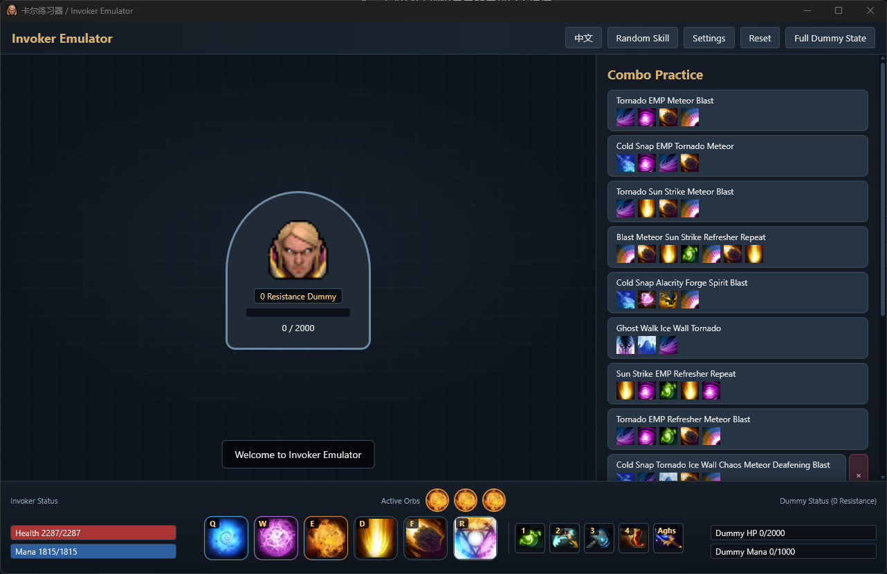
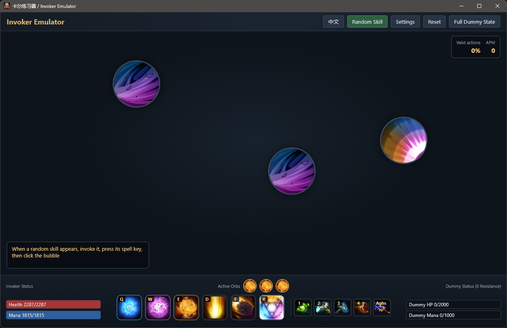
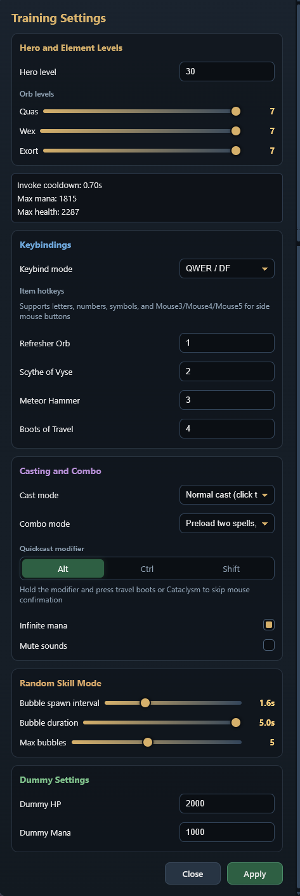

# Invoker Emulator

An offline desktop practice tool for **Invoker / Carl** in Dota 2. The project is designed for players who want to practice orb management, invoke sequences, spell combinations, combo execution, and keyboard/mouse muscle memory without joining a match.

## Features

- Three orb system with Dota 2 queue behavior
- Invoke and dual spell slots (D/F)
- All 10 invoked spells
- Global optimal combo planner with orb inheritance
- Preload combo mode: keep two invoked spells and release them in order
- Standard QWER/DF and legacy Dota 1 keybindings
- Quickcast and normal mouse confirm cast modes
- Aghanim's Scepter toggle: enables Cataclysm for Sun Strike with unique icon and cooldown
- Four-item bar: Refresher Orb, Scythe of Vyse, Meteor Hammer, Boots of Travel
- Customizable item hotkeys (letters, numbers, symbols, and mouse side buttons)
- Infinite mana toggle
- Mute toggle
- Built-in combo library
- User-defined combo builder with automatically generated optimal key sequence
- Hero level, orb level, and dummy HP/MP settings
- Official Dota 2 data-driven spell values
- Bilingual UI: Chinese (default) and English
- Persistent configuration storage
- Random skill mode: multiple random-position bubbles, supports normal and quickcast
- Quickcast modifier: configurable Alt / Ctrl / Shift

## Screenshots

### Main Interface



### Random Skill Mode



### Settings



## Tech Stack

| Layer         | Technology                             |
| ------------- | -------------------------------------- |
| Desktop shell | Tauri 2 + Rust                         |
| Frontend      | React + TypeScript + Vite              |
| Core engine   | Pure TypeScript state machine          |
| UI framework  | React                                  |
| State         | React hooks                            |
| Testing       | Vitest                                 |
| Audio         | HTML Audio API with Dota 2 game assets |
| Packaging     | Single Windows executable              |

## Requirements

- Node.js 18+
- npm
- Rust toolchain (only for building from source)
- Windows 10/11 (WebView2 Runtime is normally preinstalled)

## Development

```bash
npm install
npm run tauri -- dev
```

Run tests:

```bash
npm test
```

## Build

```bash
npm run tauri -- build --no-bundle
```

The executable is generated at:

```text
src-tauri/target/release/invoker-emulator.exe
```

All frontend assets, images, and audio files are embedded into the executable. No additional installation is required.

## Directory Structure

```text
src/
  engine/          Pure TypeScript Invoker logic
  components/      React components
  i18n.tsx         UI translations
  App.tsx          Application root
assets/            Images and audio files
data/              Official Dota 2 datafeed JSON
src-tauri/         Tauri/Rust desktop shell
scripts/           Development scripts
research/          Reference material used during development
```

## Asset Licensing

All game-related images, sound effects, and item icons are derived from Dota 2 assets owned by Valve. This project is a non-commercial open-source practice tool and declares its sources in:

```text
ATTRIBUTION.md
```

Do not redistribute the bundled assets for commercial purposes without reviewing Valve's content policies.

## License

The project code is licensed under the MIT License. The bundled Dota 2 assets remain the property of Valve.
